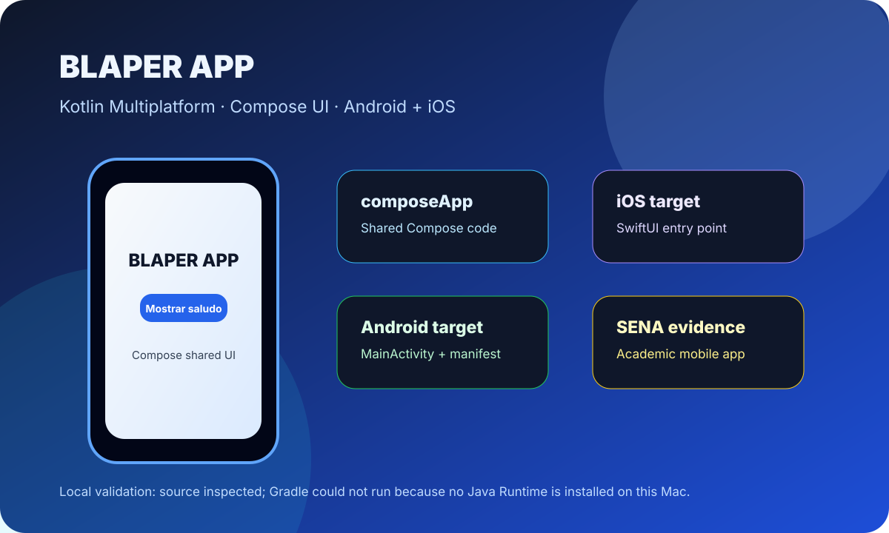

# App Android - Evidencia SENA

Aplicación móvil de evidencia SENA creada con **Kotlin Multiplatform** y **Compose Multiplatform**, con targets para Android e iOS.

<p align="center">
  
</p>

## Resumen

El proyecto contiene una app compartida en `composeApp` y una entrada nativa para iOS en `iosApp`. La UI principal muestra una pantalla sencilla de **BLAPER APP** con un botón para desplegar un saludo construido desde código común.

## Características

- Proyecto Kotlin Multiplatform.
- UI compartida con Compose Multiplatform.
- Target Android con `MainActivity` y `AndroidManifest.xml`.
- Target iOS con SwiftUI entry point.
- Recursos compartidos en `composeResources`.
- Mensaje dinámico basado en la plataforma (`Greeting().greet()`).

## Stack

- Kotlin Multiplatform
- Compose Multiplatform
- Android Gradle Plugin
- SwiftUI para entrada iOS
- Gradle Wrapper

## Estructura Relevante

```text
composeApp/src/commonMain/   # UI y lógica compartida
composeApp/src/androidMain/  # Código específico Android
composeApp/src/iosMain/      # Código específico iOS
iosApp/                      # Proyecto iOS nativo
build.gradle.kts             # Configuración raíz Gradle
settings.gradle.kts          # Módulos del proyecto
```

## Ejecución Local

Para Android, con JDK instalado:

```bash
./gradlew :composeApp:assembleDebug
```

Para desarrollo iOS, abrir `iosApp/iosApp.xcodeproj` desde Xcode.

## Validación Local

No se pudo generar una captura real de emulador en esta Mac porque Gradle no puede ejecutarse sin un Java Runtime instalado:

```text
Unable to locate a Java Runtime.
```

Validación realizada:

- Se inspeccionó la estructura Kotlin Multiplatform.
- Se confirmó la UI principal en `composeApp/src/commonMain/kotlin/com/blaperv1/project/App.kt`.
- Se confirmó el saludo multiplataforma en `Greeting.kt`.
- Se agregó una imagen honesta de overview del proyecto.

## Nota

Para completar una validación visual real, instalá JDK 11+ y ejecutá el target Android en un emulador o dispositivo físico.
